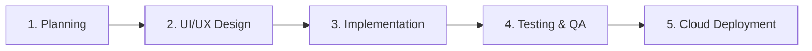

# 🚀 Task Management Web App

A clean, interactive, and responsive Task Management web application engineered to demonstrate foundational frontend architecture, modern styling, and core software development workflows.

---

## 📌 Project Overview

This project was built to explore the end-to-end lifecycle of a web application—bridging the gap between UI design, dynamic functional implementation, and cloud deployment. 

The core focus centers on implementing clean Software Development Lifecycle (SDLC) methodologies while ensuring an intuitive, accessible user experience for daily task organization.

---

## 🎯 Objectives

- **Dynamic UI Development:** Build a highly interactive interface utilizing vanilla JavaScript DOM manipulation.
- **SDLC Implementation:** Practice structured software planning, creation, testing, and shipping.
- **Responsive Styling:** Master modern utility-first CSS layouts that scale across device screens.
- **CI/CD & Version Control:** Enforce professional Git branch management and automated public deployment.

---

## ⚙️ Tech Stack & Highlights

- **Frontend Core:** HTML5, Vanilla JavaScript (ES6+)
- **Styling Engine:** Tailwind CSS Framework
- **Version Control:** Git & GitHub Architecture
- **Hosting Environment:** GitHub Pages Deployment

---

## 🔄 SDLC Development Process

1. **Planning:** Outlined features for optimal day-to-day productivity and layout efficiency.
2. **Design:** Wireframed a minimalistic workspace avoiding UI clutter.
3. **Implementation:** Developed semantic HTML frameworks, structured logical JavaScript functions, and styled elements via Tailwind tokens.
4. **Testing & Integration:** Validated component interactions, dynamic state updates, and potential edge-case bug handling.
5. **Deployment:** Pushed source branches to automated GitHub Pages architecture for public rendering.

---

## 🌟 Core Features

- ➕ **Dynamic Task Insertion:** Seamlessly append new tasks onto the display register.
- 🗑️ **On-the-Fly Deletion:** Instantly remove absolute or unneeded objective cards.
- ✅ **State Modification:** Toggle visual strikethroughs and completion states.
- 📱 **Fluid Responsiveness:** Full interface accessibility optimized for mobile, tablet, and desktop viewports.

---

## 📸 Interface Preview

| **Main Workspace Interface** | **Contextual Feature Action** |
| :---: | :---: |
|  |  |

 

| **Completed Task States** |
| :---: |
|  |

---

## 🌐 Live Application Demo

✨ **Explore the Live Site:** [Task Management Web App Demo](https://revou-coding-camp.github.io/codingcamp-04-aug-25-imammularif/)

---

## 🧠 Key Learnings

- Managing reactive software components without bloated external framework dependencies.
- Translating structural software blueprints into clean, deployable production code.
- Debugging real-time state array updates inside the client-side browser DOM.

---

## 🚀 Future Improvements

- 💾 **Persistence Layer:** Integrate LocalStorage API to save states across browser sessions.
- 📅 **Schedule Anchors:** Add contextual dates, deadlines, and sortable timelines.
- 🔍 **Query Filters:** Implement search criteria for pending, processing, and completed categories.

---

## 👨‍💻 Author

**Imammul Arif**  
📍 Indonesia  
🔗 LinkedIn: https://linkedin.com/in/imammularif  
🔗 GitHub: https://github.com/imammularif
